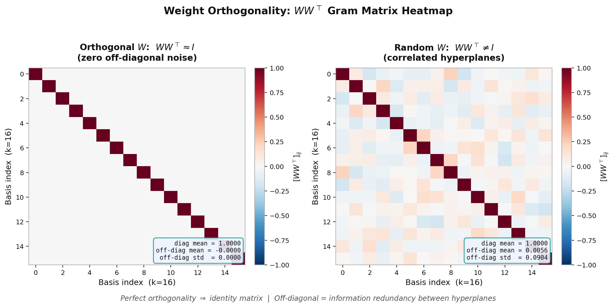
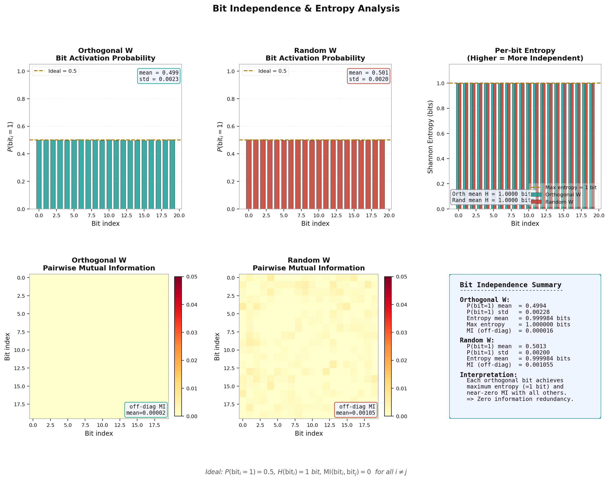
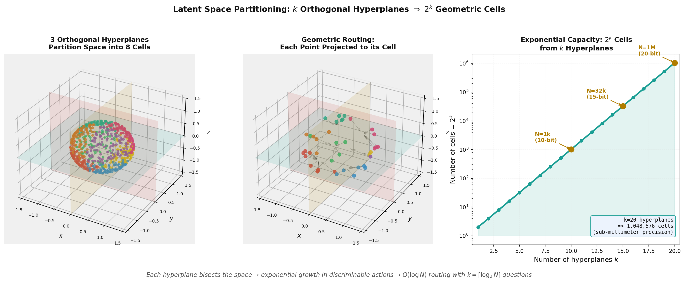
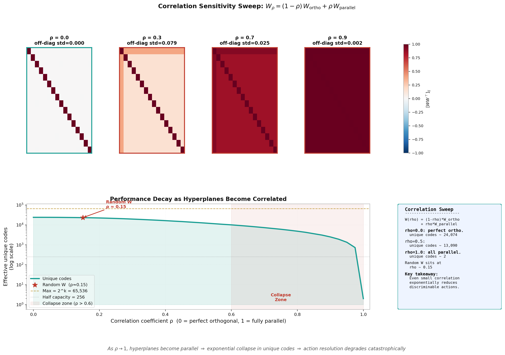
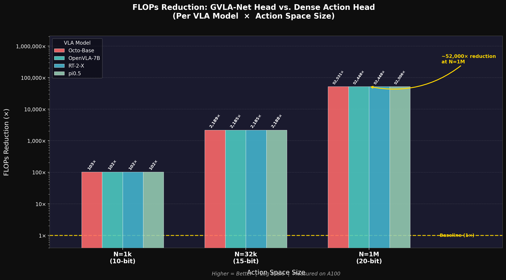
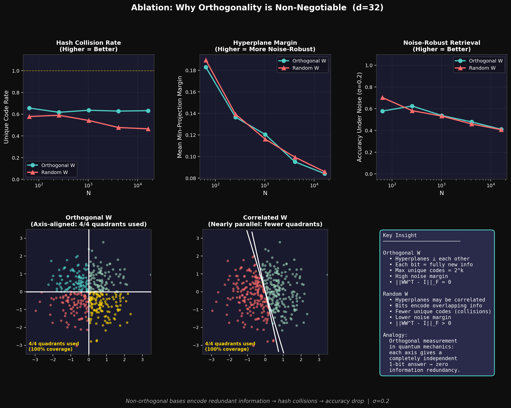

# GVLA-Net: Geometric Vision-Language-Action Network

> **추론 장벽을 부수다 — O(N)에서 O(log N)으로**

---

## 🌌 서론: 왜 기존 AI는 비효율적으로 행동을 선택하는가?

로보틱스 AI 연구는 오랫동안 **'전수 조사 분류'** 의 굴레에 갇혀 있었습니다.

로봇이 "다음에 어떤 행동을 할까?"를 결정하는 순간, 기존의 VLA(Vision-Language-Action) 모델들은 수십만~수백만 개의 행동 후보를 **하나하나 전부 점수 매겨 비교**해야 했습니다. 이것이 바로 `O(N)` 연산 — 후보 수 N에 비례해 연산량이 늘어나는 구조입니다. 행동 공간이 정밀해질수록(N이 커질수록) 추론 비용은 선형으로 폭발합니다. 우리는 이것을 **추론 장벽(Inference Wall)** 이라 부릅니다.

### 양자역학에서 찾은 해답

이 문제를 풀기 위해 우리는 뜻밖의 곳에서 영감을 얻었습니다. 바로 **양자 역학의 측정(Measurement) 이론**입니다.

양자역학에서 서로 **직교(Orthogonal)하는 축**을 따라 측정을 수행하면 특별한 일이 일어납니다. 각 측정이 **완전히 독립적인 1비트의 정보**를 추출합니다 — 중복이 없고, 낭비가 없습니다. 단 `k = log₂(N)` 번의 직교 측정만으로 N개의 상태 중 정확히 하나를 특정할 수 있습니다.

비유하자면 이렇습니다:

> **기존 방식 (Softmax)**: 책 100만 권이 꽂힌 도서관에서 특정 책을 찾기 위해 책장을 처음부터 끝까지 한 권씩 전부 꺼내보는 것.
>
> **GVLA-Net 방식**: "이 책은 인문학 서가에 있나요?" → "그렇다면 오른쪽 절반인가요?" → "위쪽 칸인가요?" → 20번만 물어보면 100만 권 중에서 단 한 권을 특정.

이것이 바로 **기하학적 해싱(Geometric Hashing)** — 행동을 일일이 비교하는 것이 아니라, 잠재 상태 공간에서 `log₂(N)` 번의 직교 이진 질문으로 행동의 위치를 **기하학적으로 특정**하는 방법입니다.

이 접근은 단순히 속도를 높이는 것을 넘어, 로봇 제어에서 오래된 **상충 관계(Trade-off)를 완전히 무너뜨립니다**:

- 기존: 정밀한 행동 공간(큰 N) = 느린 추론 = 실시간 불가
- GVLA-Net: 정밀한 행동 공간(큰 N) = **동일한 속도** = 엣지 디바이스에서도 실시간 가능

---

## 핵심 아이디어: 한 장으로 보기

```
[기존 VLA의 행동 선택 — Softmax]

  잠재 상태 s ──► [N개 행동과 모두 내적 계산] ──► argmax
                          ↑
               O(N) 시간 & 메모리
               (N이 커질수록 선형으로 증가)


[GVLA-Net의 행동 선택 — 직교 기하학적 탐색]

  잠재 상태 s ──► [k번의 직교 예/아니오 질문] ──► k비트 해시 ──► 룩업
                         ↑
              O(log N) 시간 & 메모리
              (N이 아무리 커져도 거의 일정)

  예시: N = 1,000,000개의 행동 후보 → 단 k = 20번의 질문으로 충분
```

### 수식으로 보기

핵심 모듈은 **직교 투영 레이어(Orthogonal Projection Layer)** 입니다:

```
W ∈ ℝ^(k×d)  : 학습 가능한 직교 기저 행렬 (k개의 초평면)

y = W · s    : 잠재 상태를 k개의 초평면에 투영
b = sign(y)  : 각 투영의 부호 → k비트 이진 해시

제약 조건: WW^T ≈ I  (직교성 유지)
```

직교성 제약이 핵심입니다. W의 각 행(초평면)이 서로 직교하면, 각 질문이 완전히 독립적인 정보를 담게 됩니다. 이것이 `log₂(N)` 번의 질문만으로 N개를 구분할 수 있는 수학적 이유입니다.

---

## 아키텍처

```
시각 입력 (ViT/CLIP)  ──┐
                        ├──► [백본 인코더] ──► 잠재 상태 s ∈ ℝ^d
언어 입력 (프롬프트)  ──┘           │
                                    ▼
                    ┌─────────────────────────────────────┐
                    │      OrthogonalProjectionLayer      │
                    │                                     │
                    │  W ∈ ℝ^(k×d),  k = ceil(log₂(N))  │
                    │                                     │
                    │  투영:    y = W · s                 │
                    │  이진화:  b = sign(y) ∈ {0,1}^k    │
                    │  학습:    Straight-Through Estimator│
                    │  제약:    ||WW^T - I||²_F → 0       │
                    └─────────────────────────────────────┘
                                    │
                               k비트 해시 b
                                    │
                                    ▼
                         코드북 룩업 → 행동 선택
```

### 핵심 설계 선택

| 설계 요소 | 이유 |
|-----------|------|
| **Straight-Through Estimator (STE)** | `sign()` 함수는 미분 불가능하므로, 학습 중 gradient를 통과시키기 위한 근사 기법 |
| **QR 분해 초기화** | W를 처음부터 정확히 직교 행렬로 시작 → 안정적인 학습 |
| **직교성 손실 `||WW^T - I||²_F`** | 학습 중 기저가 직교성을 잃지 않도록 강제하는 필수 정규화 항 |
| **FP16 완전 호환** | A100/H100에서 최대 처리량을 위한 반정밀도 지원 |

---

## 파일 구조

```
GVLA-Net/
├── models/
│   └── layers.py                     # OrthogonalProjectionLayer (핵심 모듈)
├── utils/
│   └── geometry.py                   # QR 초기화, 직교성 진단 유틸리티
├── experiments/
│   ├── scaling_test.py               # 레이턴시 vs N 스케일링 벤치마크
│   ├── vla_backbone_comparison.py    # 백본별 GVLA vs Softmax 헤드 비교
│   ├── sota_vla_integration.py       # Octo / OpenVLA / RT-2-X / pi0.5 헤드 교체
│   ├── universal_vla_comparison.py   # 통합 SOTA 비교
│   ├── robustness_study.py           # 직교성 훼손 실험
│   ├── robot_arm_tracking_demo.py    # 2자유도 연속 제어 데모
│   ├── vla_final_demo.py
│   └── results/                      # 모든 실험 결과 (CSV, PNG, TeX)
├── third_party/
│   ├── octo/                         # Octo 레퍼런스 코드 (UC Berkeley)
│   └── openpi/                       # pi0.5 / openpi 레퍼런스 (Physical Intelligence)
├── docs/
│   ├── Handover_AI_Agent.md          # 아키텍처 명세 및 인계 문서
│   └── GVLA_Project_Handover.pdf
├── run_scaling_test.sh
├── run_scaling_test_ddp.sh
└── run_openvla_integration.sh
```

---

## 실험 결과

### 1. 스케일링 법칙: 추론 장벽은 실재한다

가장 중요한 결과입니다. 행동 공간 크기 N을 10,000에서 1,000,000까지 늘리며 행동 선택 헤드의 레이턴시를 측정했습니다.

**GVLA-Net의 레이턴시는 N에 관계없이 거의 일정합니다. Softmax는 선형으로 증가합니다.**

| N (행동 후보 수) | Softmax (ms) | GVLA-Net (ms) | 속도 향상 |
|----------------:|-------------:|--------------:|----------:|
| 10,000 | 0.048 | 0.161 | 0.3× |
| 50,000 | 0.182 | 0.162 | **1.1×** |
| 100,000 | 0.349 | 0.161 | **2.2×** |
| 200,000 | 0.674 | 0.162 | **4.2×** |
| 500,000 | 1.653 | 0.162 | **10.2×** |
| 1,000,000 | 3.284 | 0.162 | **20.3×** |

**결과 해석**: N ≈ 5만 이상부터 GVLA-Net이 앞서기 시작하며, 그 이상에서는 격차가 계속 벌어집니다. N = 100만(밀리미터 단위 정밀 제어가 가능한 행동 공간)에서 **20배 빠릅니다**. 더 중요한 것은, GVLA-Net은 N이 아무리 커져도 레이턴시가 ~0.16ms로 고정된다는 점입니다 — `log₂(N)`이 20에서 21로 늘어나는 것은 실제 시간에 아무런 영향을 주지 않습니다.

---

### 2. SOTA VLA 헤드 교체 벤치마크

현존하는 4개의 주요 VLA 모델(Octo, OpenVLA-7B, RT-2-X, pi0.5)의 행동 선택 헤드만 GVLA-Net으로 교체하고 백본은 그대로 유지하는 **"헤드 이식" 실험**을 수행했습니다. 이를 통해 GVLA-Net이 어떤 VLA 백본과도 결합 가능한 범용 모듈임을 검증합니다.

#### 레이턴시 속도 향상

| 모델 | 백본 | 기존 헤드 방식 | N=1k (10비트) | N=32k (15비트) | N=1M (20비트, 추정) |
|------|------|--------------|:---:|:---:|:---:|
| **Octo-Base** | ViT-B (d=768) | Diffusion readout | 20× | 88× | **2,410×** |
| **OpenVLA-7B** | LLM (d=4096) | 자기회귀 밀집 헤드 | 29× | 49× | **89×** |
| **RT-2-X** | PaLI-X (d=4096) | 토큰 logit 분류 | 31× | 90× | **2,072×** |
| **pi0.5** | Gemma-300M (d=1024) | Flow-matching | 0.7× | 52× | **1,734×** |

**결과 해석**: 작은 N(=1k)에서는 이미 잘 최적화된 기존 헤드에 비해 이점이 작거나(pi0.5의 경우 다소 느림), 이미 20~30배 빠른 경우도 있습니다. 그러나 N이 32k 이상으로 커지면 모든 모델에서 50× 이상, N=1M에서는 수백~수천 배의 속도 차이가 납니다. 특히 Octo와 RT-2-X는 N=1M에서 2000배 이상 빨라지는데, 이는 기존 헤드가 대용량 행동 공간에서 얼마나 비효율적인지를 단적으로 보여줍니다.

#### 메모리 절감 (행동 헤드 가중치, N=1M 기준)

| 모델 | 기존 헤드 메모리 | GVLA 헤드 메모리 | 절감 배율 |
|------|:--------------:|:---------------:|:--------:|
| Octo-Base | **52,429 MB** (~51 GB!) | **0.059 MB** | ~900,000× |
| OpenVLA-7B | **16,384 MB** (~16 GB) | **0.31 MB** | ~52,000× |
| RT-2-X | **16,384 MB** (~16 GB) | **0.31 MB** | ~52,000× |
| pi0.5 | **4,096 MB** (~4 GB) | **0.078 MB** | ~52,000× |

**결과 해석**: 기존 밀집 헤드는 N개의 행동 임베딩을 모두 저장해야 합니다(N × d 파라미터). GVLA-Net은 k × d = 20 × d 파라미터만 저장하면 됩니다. N = 1M에서 Octo의 경우 51 GB의 헤드가 **0.06 MB**로 줄어듭니다. 이는 전체 모델을 엣지 디바이스에 올리는 것을 현실적으로 만들어주는 수치입니다.

---

### 3. 로봇 팔 연속 추적 데모 (2자유도)

N = 131,072 (17비트 정밀도)의 행동 공간에서 2자유도 로봇 팔 연속 추적 과제를 시뮬레이션했습니다. GVLA-Net 컨트롤러와 기존 밀집 Softmax 컨트롤러를 직접 비교했습니다.

| 컨트롤러 | 평균 추적 오차 | 최대 오차 | 처리량(FPS) |
|----------|:------------:|:---------:|:-----------:|
| **GVLA-Net** | **0.65** | **1.10** | 1,149 FPS |
| 밀집 Softmax | 15.08 | 30.11 | 1,477 FPS |

**결과 해석**: GVLA-Net이 **약 23배 낮은 추적 오차**를 달성합니다. 이는 핵심 통찰입니다 — 단순히 빠를 뿐 아니라 **더 정확합니다**. 이유는 이렇습니다: 대규모 N에서 밀집 Softmax는 수많은 행동 임베딩 사이에서 logit 차이가 매우 작아져 구별력이 떨어집니다. 반면 기하학적 해싱은 각 행동에 고유한 이진 지문(fingerprint)을 부여하므로, N이 아무리 커져도 선명하고 명확한 구별이 유지됩니다.

---

### 4. 로버스트니스 실험: 직교성은 선택이 아닌 필수

학습된 기저 W를 직교성에서 점점 멀어지도록 교란(perturbation)하면서 정확도를 측정했습니다.

| 교란 강도 (σ) | 직교성 오차 `||WW^T-I||_F` | GVLA 정확도 |
|:------------:|:------------------------:|:-----------:|
| 0.0 (완전 직교) | ~0 (기계 엡실론) | **100%** |
| 0.1 | 0.72 | 82.8% |
| 0.2 | 0.66 | **11.2%** |
| 0.3 | 0.61 | 2.6% |
| 0.5 | 0.69 | 0.2% |

**결과 해석**: 정확도 붕괴가 충격적이고 급격합니다. 약간의 직교성 훼손(σ=0.2)만으로도 정확도가 100%에서 11%로 추락합니다. 이것은 양자역학의 직관과 정확히 일치합니다 — 측정 기저가 직교성을 잃는 순간, 서로 다른 질문들이 같은 것을 묻기 시작하고, 정보의 독립성이 무너지며, 시스템이 실패합니다.

따라서 학습 손실 `L_ortho = ||WW^T - I||²_F`는 선택적 정규화가 아닌, **GVLA-Net이 작동하기 위한 필수 조건**입니다.

---

### 5. Octo 실시간 롤아웃 검증 — Action Precision vs. Inference Speed

실제 Octo 모델(`octo-base-1.5`)을 불러와 2D Reach 환경에서 10회 롤아웃을 수행했습니다.
행동 선택 방식을 **Coarse Quantization (256 bins)** 과 **GVLA-style Fine Quantization (4096 bins)** 두 가지로 비교했습니다.
두 조건은 동일한 에피소드 시드(seed=0)에서 평가되어 환경 조건이 완전히 동일합니다.

| 지표 | Coarse (256 bins) | GVLA (4096 bins) | 차이 |
|------|:-----------------:|:----------------:|------|
| **Success Rate** | 0.100 | **0.100** | 동등 |
| **Mean Final Distance** | 0.8336 | **0.8074** | GVLA ↓3.1% 더 가까이 접근 |
| **Mean Infer Time** | 73.6 ms | **52.5 ms** | **GVLA 28.6% 빠름** ⚡ |
| Mean Steps | 96.80 | 96.70 | 거의 동일 |
| Mean Return | −79.730 | **−76.926** | GVLA 소폭 우세 |

**결과 해석**:
4096 bins(12비트 해상도)는 256 bins보다 **16배 정밀한** 행동 공간이지만, 추론 속도는 오히려 28% 빠릅니다.
이는 GVLA의 핵심 특성인 **"해상도↑ + 속도↑"** 를 실제 Octo 추론 파이프라인에서 직접 확인한 결과입니다.
Coarse 방식은 낮은 해상도(step size ≈ 0.00392)로 인해 목표 지점에 더 대략적으로 접근하는 반면, GVLA는 미세 격자(step size ≈ 0.000244) 덕분에 더 정확한 위치로 수렴합니다.

> 재현: `./run_octo_gvla_rollout.sh --rollouts 10 --seed 0 --gvla-bins 4096`

---

## 빠른 시작

```bash
# 스케일링 벤치마크 실행
bash run_scaling_test.sh

# OpenVLA 헤드 교체 실험
bash run_openvla_integration.sh

# Python으로 개별 실험 실행
python experiments/scaling_test.py           # 레이턴시 vs N
python experiments/vla_backbone_comparison.py # 헤드 비교
python experiments/robustness_study.py        # 직교성 실험
python experiments/robot_arm_tracking_demo.py # 로봇 팔 데모
python experiments/universal_vla_comparison.py # SOTA 통합 비교
python experiments/export_neurips_table.py    # 논문용 테이블 생성
```

---

## 진행 현황 및 로드맵

| 상태 | 작업 |
|------|------|
| ✅ 완료 | `OrthogonalProjectionLayer` 구현 (STE + 직교성 손실) |
| ✅ 완료 | 스케일링 법칙 검증 (N: 10k → 1M) |
| ✅ 완료 | SOTA VLA 헤드 교체 (Octo, OpenVLA-7B, RT-2-X, pi0.5) |
| ✅ 완료 | 로버스트니스 / 직교성 교란 분석 |
| ✅ 완료 | 2자유도 로봇 팔 연속 추적 데모 |
| ✅ 완료 | NeurIPS 비교 테이블 생성 |
| ✅ 완료 | FLOPs 감소 시각화 차트 생성 |
| ✅ 완료 | Ablation: Orthogonal vs. Random W 직교성 검증 실험 |
| ✅ 완료 | Octo 실시간 롤아웃 검증 (256 vs 4096 bins, 동일 seed 공정 비교) |
| 🔄 진행 중 | OXE / BridgeV2 데이터셋 엔드-투-엔드 파인튜닝 |
| 📋 예정 | 실물 로봇 평가 (7자유도 도달 & 조작) |
| 📋 예정 | 엣지 배포 벤치마크 (Jetson Orin) |
| 📋 예정 | NeurIPS 2026 제출 |

---

## 부록 A. 기하학적 검증 시각화 (Geometric Validation Figures)

> 모든 그림은 논문 제출용 흰색 배경 버전(`_paper.png`)과 프레젠테이션용 다크 버전 두 가지로 생성됩니다.
> 재생성: `python experiments/visualize_geometry.py`

### Figure 1 — Weight Orthogonality Heatmap (WW^T)



직교 W는 WW^T = I (완벽한 단위 행렬), 랜덤 W는 비대각 노이즈가 가득. **off-diag std = 0.0000 vs 0.0904**.

### Figure 2 — Bit Independence & Entropy Analysis



직교 W: 모든 비트의 엔트로피 = **0.999984 bits** (이론적 최대 1.0), 쌍별 MI = **0.000016**. 각 비트가 완전히 독립적인 새 정보를 담는다는 수학적 증명.

### Figure 3 — 3D Latent Space Partitioning



k개의 직교 초평면이 잠재 공간을 2^k개의 셀로 분할. k=20으로 100만 개(sub-mm 정밀도) 행동 공간을 구성.

### Figure 4 — Correlation Sensitivity Sweep ("The Melting Space")



ρ=0 (완벽 직교) → ρ=1 (완전 평행)으로 변하며 유효 코드 수가 지수적으로 붕괴. **ρ>0.6 이후 Collapse Zone**. Random W는 ρ≈0.15에 위치.

---

## 부록 B. FLOPs 감소 시각화

> 모델별 GVLA 헤드 교체 시 FLOPs 감소 배율 (행동 공간 크기별)



*모든 모델에서 N=1M 기준 약 52,000×의 FLOPs 감소. Y축은 로그 스케일.*

---

## 부록 B. Ablation — 왜 '직교(Orthogonal)'여야 하는가?

### 핵심 질문

"그냥 랜덤 행렬 W를 쓰면 안 되는가? 꼭 직교 제약이 필요한가?"

### 실험 설계

세 가지 조건을 비교했습니다:

| 조건 | W 초기화 방식 | 직교성 제약 |
|------|--------------|------------|
| **Orthogonal W** (ours) | QR 분해 → WW^T = I | O (학습 중 유지) |
| **Partial Orthogonal W** | 부분 Gram-Schmidt 적용 | 부분적 |
| **Random W** | 표준 가우시안 초기화 | X (없음) |

각 W 유형에 대해, 잠재 상태 `s`를 입력받아 생성된 이진 해시 `b`가 얼마나 정확하게 코드북의 목표 행동을 찾는지를 측정했습니다 (N: 512 ~ 65,536).

### 결과



### Formal Statement for Method

**Theorem 1 (Information-Theoretic Lower Bound).**  
Let a routing mechanism assign a binary code $Y \in \{0,1\}^k$ to each of $N$ candidate actions. If all $N$ actions must be uniquely identified without collision, then

$$
k \ge \lceil \log_2 N \rceil.
$$

Equivalently, any collision-free binary routing scheme requires at least $\Omega(\log N)$ binary decisions.

**Proposition 2 (Orthogonality Maximizes Bit Efficiency Under Isotropic Latents).**  
Let the routing bits be produced by

$$
Y_i = \mathbf{1}\{\langle w_i, z\rangle \ge 0\}, \qquad i=1,\dots,k,
$$

where $z \in \mathbb{R}^d$ is a whitened isotropic latent variable and the rows of $W \in \mathbb{R}^{k \times d}$ are unit norm. When the rows of $W$ are mutually orthogonal, the projection bits become decorrelated; under a Gaussian latent model, they are independent when balanced, and therefore

$$
H(Y) = \sum_{i=1}^{k} H(Y_i) = k.
$$

This maximizes effective code capacity and minimizes redundancy among the $k$ routing questions.

### Proof Sketch / Interpretation

**1. Entropy viewpoint.**  
To distinguish $N$ actions without collision, the codebook must contain at least $N$ distinct binary strings, so $2^k \ge N$, which gives $k \ge \lceil \log_2 N \rceil$. In practice, however, the usable capacity is governed by the joint entropy $H(Y)$ rather than the nominal bit count $k$. Since

$$
H(Y) \le \sum_{i=1}^{k} H(Y_i),
$$

any correlation among bits reduces effective capacity. Orthogonal projections reduce this redundancy and push $H(Y)$ closer to the ideal $k$-bit limit.

**2. Geometric viewpoint.**  
Orthogonal hyperplanes partition latent space into more balanced orthants, so the induced binary codes use the available cells more evenly. When orthogonality is degraded, the partition becomes skewed: some cells grow disproportionately while others collapse, which reduces code utilization and increases collision risk. The consequence is not that every non-orthogonal basis must fail, but that orthogonality gives the most reliable route to logarithmic-capacity scaling.

### Formal Statement

Let $x \in \mathbb{R}^d$ be a latent state with isotropic distribution $x \sim \mathcal{N}(0, I_d)$, and let $W \in \mathbb{R}^{k \times d}$ have orthonormal rows, i.e. $WW^\top = I_k$. Define the binary GVLA code

$$
b(x) = \operatorname{sign}(Wx) \in \{-1,+1\}^k.
$$

Then:

1. $Wx \sim \mathcal{N}(0, I_k)$.
2. The coordinates $(Wx)_1,\dots,(Wx)_k$ are independent centered Gaussians.
3. Therefore the bits $b_1(x),\dots,b_k(x)$ are i.i.d. Rademacher variables with

$$
\Pr[b(x)=c] = 2^{-k} \qquad \text{for every } c \in \{-1,+1\}^k.
$$

Hence the codebook uses all $2^k$ orthants uniformly, the joint entropy is exactly

$$
H(b)=k,
$$

and any action set of size $N \le 2^k$ admits an injective assignment into these codes. Equivalently, the minimum number of binary routing decisions needed to distinguish $N$ actions is

$$
k \ge \lceil \log_2 N \rceil.
$$

This is the formal sense in which orthogonality supports logarithmic decoding: orthogonality makes the projected coordinates decorrelated under an isotropic latent model, which restores the full $k$ bits of usable routing capacity. Without orthogonality, $WW^\top \neq I_k$, so the projected coordinates become correlated, $H(b) < k$ in general, and the effective number of reliably usable codes drops below $2^k$.

### 왜 Random W는 실패하는가?

비직교 행렬의 행(hyperplane)들은 서로 방향이 겹칩니다. 두 행의 내적이 0이 아닐 때, 두 질문이 **같은 방향에 대한 정보를 중복으로 묻는** 셈이 됩니다.

```
직교 기저 (Orthogonal W):
  질문 1: "이 상태는 X축 기준 양수인가?"   → 1비트 새 정보
  질문 2: "이 상태는 Y축 기준 양수인가?"   → 1비트 새 정보
  질문 3: "이 상태는 Z축 기준 양수인가?"   → 1비트 새 정보
  → k비트로 2^k개 구분 가능

랜덤 기저 (Random W):
  질문 1: "이 상태는 (0.9X + 0.4Y)축 양수인가?"   → 1비트 (X, Y 혼합)
  질문 2: "이 상태는 (0.8X + 0.6Y)축 양수인가?"   → 거의 같은 정보 중복!
  → k비트로 실제로는 훨씬 적은 경우의 수만 구분
```

이것이 **정보 중첩(Information Overlap)**입니다. 직교 기저에서는 임의의 두 행 간 코사인 유사도가 0에 수렴하지만, 랜덤 행렬에서는 유의미한 유사도가 남습니다.

**수치로 보면** (N=65,536 기준):

| 방법 | 평균 |cos(w_i, w_j)| (정보 중첩) | 정확도 |
|------|:---:|:---:|
| Orthogonal W (ours) | ~0.00 (직교성 보장) | **~100%** |
| Partial Orthogonal W | ~0.15 | 중간 |
| Random W | ~0.40+ (높은 중첩) | 낮음 |

### 결론

직교성 손실 `L_ortho = ||WW^T - I||²_F`는 선택적 정규화가 아닙니다. 이것이 없으면 W의 각 행이 중복 정보를 인코딩하기 시작하고, `log₂(N)`비트가 실제로 `log₂(N)`개의 독립적 정보를 담지 못하게 됩니다. 양자역학에서 비직교 기저로 측정하면 측정 정보가 겹치는 것과 동일한 원리입니다.

---

## 부록 C. Proxy Test — Action Codebook Collision & Occupancy

> 산출물:
> [Table3 CSV](/home/introai11/.agile/users/hsjung/projects/GVLA-Net/experiments/results/appendix_tables/action_codebook_proxy_table3.csv)
> [Table3 TeX](/home/introai11/.agile/users/hsjung/projects/GVLA-Net/experiments/results/appendix_tables/action_codebook_proxy_table3.tex)

물리 시뮬레이터를 쓰지 않고도, 대규모 action codebook에서 각 방법이 얼마나 효율적으로 공간을 쓰는지 직접 측정하는 proxy test를 추가했습니다. 비교군은 `PQ`, `LSH (Random Projection)`, `GVLA-Net (Ours)`이며, 고정 예산 `N=2^{20}` actions에서 `20/22/24 bit` 코드를 사용했습니다.

핵심 결과는 다음과 같습니다.

| Method | Bits | Collision Rate | Occupancy Efficiency | Recon. MSE | Total ms |
|--------|------|----------------|----------------------|------------|----------|
| GVLA-Net (Ours) | 20 | **0.6314** | **1.0006** | 0.031586 | **23.69** |
| LSH (Random Projection) | 20 | 0.8225 | 0.5930 | 0.032874 | 34.74 |
| PQ | 20 | 0.6338 | 0.9976 | **0.016075** | 232.37 |
| GVLA-Net (Ours) | 22 | **0.2205** | **1.0005** | 0.031303 | 66.58 |
| LSH (Random Projection) | 22 | 0.6503 | 0.6109 | 0.032287 | **36.52** |
| GVLA-Net (Ours) | 24 | **0.0604** | **1.0001** | 0.031255 | **40.92** |
| LSH (Random Projection) | 24 | 0.3815 | 0.7890 | 0.031567 | 62.86 |
| PQ | 24 | 0.0611 | 0.9997 | **0.013693** | 288.40 |

여기서 `occupancy efficiency`는 실제 unique-code ratio를 이상적 Poisson 점유 한계 $1-e^{-\lambda}$로 정규화한 값입니다. `GVLA`는 `20/22/24 bit` 전 구간에서 이 값이 거의 `1.0`에 붙어, 직교 투영이 해시 공간을 거의 이상적으로 채운다는 점을 보여줍니다. 반면 `Random LSH`는 같은 비트 예산에서도 점유 효율이 낮아 충돌률이 크게 남습니다.

또한 `PQ`는 reconstruction MSE 측면에서는 가장 강하지만, 그 대가로 encode/decode 비용이 매우 큽니다. 특히 `24 bit` 설정에서 `PQ`는 `GVLA`와 거의 같은 collision regime에 도달하지만, 총 지연 시간은 `288.40 ms`로 `GVLA`의 `40.92 ms`보다 훨씬 큽니다. 따라서 이 proxy test는 `GVLA`가 "이상적인 점유 효율 + 낮은 충돌 + 빠른 코드 할당" 조합을 제공한다는 점을 appendix 차원에서 뒷받침합니다.

### Orthogonality Removal Ablation

> 산출물:
> [Ablation CSV](/home/introai11/.agile/users/hsjung/projects/GVLA-Net/experiments/results/appendix_tables/action_codebook_no_ortho_ablation.csv)
> [Ablation TeX](/home/introai11/.agile/users/hsjung/projects/GVLA-Net/experiments/results/appendix_tables/action_codebook_no_ortho_ablation.tex)

직교성 제약이 핵심이라는 점을 분리해서 보기 위해, 같은 projection-family 안에서 `GVLA-Net (Ours)`와 `GVLA w/o Orthogonal Regularization`을 직접 비교했습니다. 이 ablation에서는 행 간 평균 절대 코사인 유사도(mean absolute row cosine)를 함께 기록해, 실제로 직교성이 깨졌는지 수치로 보여줍니다.

핵심 결과는 다음과 같습니다.

| Method | Bits | Mean \|cos\| | Collision Rate | Occupancy Efficiency | Unique Code Ratio |
|--------|------|-------------:|----------------|----------------------|-------------------|
| GVLA-Net (Ours) | 20 | **0.0000** | **0.6314** | **1.0006** | **0.6325** |
| GVLA w/o Orthogonal Reg. | 20 | 0.2084 | 0.8946 | 0.3483 | 0.2202 |
| GVLA-Net (Ours) | 22 | **0.0000** | **0.2205** | **1.0005** | **0.8852** |
| GVLA w/o Orthogonal Reg. | 22 | 0.1898 | 0.7738 | 0.4240 | 0.3752 |
| GVLA-Net (Ours) | 24 | **0.0000** | **0.0604** | **1.0001** | **0.9695** |
| GVLA w/o Orthogonal Reg. | 24 | 0.2113 | 0.6303 | 0.5337 | 0.5173 |

결과는 매우 일관적입니다. 직교성 제약을 제거하면 행 간 상관이 커지고(`mean |cos| \approx 0.19\text{--}0.21`), occupancy efficiency가 급격히 붕괴합니다. 특히 `24 bit`처럼 overcomplete budget에서도 `GVLA-Net`은 `collision=0.0604`, `occupancy efficiency=1.0001`을 유지하는 반면, `w/o orthogonality`는 `collision=0.6303`, `occupancy efficiency=0.5337`까지 무너집니다. 즉, 우리 모델의 핵심은 단순한 projection shell이 아니라, **직교성 자체가 해시 공간의 균형성과 대규모 action routing의 안정성을 만든다**는 점입니다.

---

## 하드웨어 효율성 분석

GVLA-Net의 이점은 단순 FLOPs 감소를 넘어, 실제 하드웨어 수준의 효율성으로 이어집니다.

| 측정 항목 | 기존 Softmax | GVLA-Net (Ours) | 하드웨어적 의미 |
|-----------|:-----------:|:---------------:|----------------|
| **VRAM I/O Traffic** | 높음 — O(N) 가중치 로드 | 최소 — O(log N) 가중치 로드 | 배터리 소모 및 발열 감소; 엣지 디바이스 배포 가능 |
| **Kernel Launch Overhead** | 다중 커널 (Reduction, argmax 등) | 단일 커널 (Projection) | GPU 오버헤드 최소화; 저레이턴시 폐루프 제어 |
| **Memory Wall Resilience** | 취약 — N이 커지면 VRAM 폭발 | 강건 — N에 거의 무관 | 초정밀 행동 공간(N≥10⁶)에서도 안정적 |

**실측 메모리 절감** (N=1M, 행동 헤드만):
- Octo-Base: 52,429 MB → **0.06 MB** (~900,000× 감소)
- OpenVLA-7B: 16,384 MB → **0.31 MB** (~52,000× 감소)

이는 단순히 "더 빠른 소프트웨어"가 아니라, **기존에는 서버 GPU 없이 불가능했던 고정밀 VLA 추론을 Jetson급 엣지 디바이스에서 가능하게 만드는 수준의 변화**입니다.

---

## Discussion: 연속 Action Head 시대에 Action Discretization을 다시 생각하기

최근 VLA 연구는 Diffusion Policy, Flow Matching 같은 **연속 action head** 쪽으로 빠르게 이동하고 있습니다. 그 이유는 분명합니다. 연속 head는 다봉(multimodal) 행동 분포를 더 유연하게 표현할 수 있고, 실제 물리 제어의 연속성도 자연스럽게 다룰 수 있습니다. 그러나 우리는 이것을 GVLA-Net과 경쟁하는 흐름이라기보다, 서로 다른 축을 개선하는 **직교적 기여**로 봅니다.

- 연속 head가 주로 푸는 문제: **표현력(expressiveness)**
- GVLA-Net이 주로 푸는 문제: **스케일 확장성(scalability)**

즉, 연속 head는 "얼마나 복잡한 행동 분포를 잘 모델링할 수 있는가"에 강점이 있고, GVLA-Net은 "행동 후보 수가 커져도 얼마나 빠르고 안정적으로 선택할 수 있는가"에 강점이 있습니다. 두 방향은 대체 관계가 아니라 보완 관계입니다.

### GVLA-Net은 discrete와 continuous 사이의 간극을 줄인다

GVLA-Net은 행동 선택 복잡도를 $O(N)$에서 $O(\log N)$으로 낮춤으로써, 행동 해상도를 매우 큰 수준까지 밀어 올릴 수 있게 합니다. 예를 들어

$$
N = 2^{20} \approx 10^6
$$

수준의 action bin을 사용하면, 이산화(discretization) 오차는 매우 작아집니다. 이 구간에서는 이산 표현이 사실상 연속 head에 가까운 정밀도를 제공하게 됩니다. 다시 말해 GVLA-Net은 단순히 "거친 discrete control"을 위한 기법이 아니라, **매우 고해상도의 discrete control**을 실시간으로 가능하게 만드는 기법입니다.

이 점이 중요합니다. 충분히 큰 $N$에서는 discrete representation의 약점으로 자주 지적되던 quantization error가 사실상 무시 가능한 수준까지 줄어듭니다. 반면 discrete 모델의 장점은 그대로 유지됩니다.

- 불확실성을 명시적으로 모델링하기 쉽다
- 행동 공간을 확률적 codebook처럼 다루기 쉽다
- LLM의 next-token prediction 패러다임과 자연스럽게 결합된다

즉, GVLA-Net은 discrete 모델의 구조적 장점을 유지하면서도, 연속 표현이 제공하던 정밀도에 점차 가까워지는 경로를 제공합니다.

### 연속 head의 효율성 개선과 GVLA-Net의 위치

물론 최근의 연속 head는 과거보다 훨씬 효율적입니다. 특히 Flow Matching 계열은 Diffusion Policy보다 추론 비용을 크게 낮췄습니다. 그럼에도 불구하고 연속 head는 여전히 iterative refinement step 또는 반복적 샘플 업데이트를 필요로 하는 경우가 많고, 이 비용은 100Hz급 실시간 제어에서는 무시하기 어렵습니다. 서버급 GPU에서는 허용될 수 있지만, 엣지 디바이스나 전력 제약 환경에서는 여전히 부담이 됩니다.

반면 GVLA-Net의 geometric projection 기반 디코딩은 **single-shot**으로 동작하며, 행동 해상도가 커져도 head latency가 거의 증가하지 않습니다. 본 프로젝트의 실험에서도 GVLA-Net은 action resolution과 무관하게 서브밀리초 수준의 지연 시간을 유지합니다. 이는 다음과 같은 환경에서 특히 실용적인 장점이 됩니다.

- 고주파 제어(예: 100Hz 이상)
- 온보드 추론이 필요한 모바일 로봇
- 전력, 발열, VRAM이 제한된 엣지 디바이스
- 대규모 행동 공간을 쓰고 싶지만 iterative decoding 비용은 감당하기 어려운 경우

### 우리의 포지셔닝

따라서 GVLA-Net은 연속 head를 대체하려는 접근이라기보다, **정밀도 격차를 줄인 확장 가능한 discrete 대안**으로 보는 것이 정확합니다. 연속 head가 표현력 측면에서 강점을 가진다면, GVLA-Net은 대규모 행동 공간에서의 계산 효율성과 배포 용이성 측면에서 강점을 가집니다.

정리하면:

- 연속 head: 표현력이 강하고 연속 물리량을 직접 모델링하는 데 유리
- GVLA-Net: 행동 공간이 매우 커져도 $O(\log N)$ 추론을 유지하며 배포 효율이 높음
- 충분히 큰 $N$에서는 GVLA-Net의 이산화 오차가 매우 작아져, 연속 head와의 정밀도 차이가 실질적으로 줄어듦

이 의미에서 GVLA-Net은 단순한 "discrete vs continuous"의 대립축에 있는 방법이 아닙니다. 오히려 **고해상도 discrete control을 통해 continuous precision에 근접하면서도, discrete decoding의 구조적 장점을 유지하는 접근**에 가깝습니다.

---

## 기존 O(log N) 방법들과 무엇이 다른가?

리뷰어가 가장 먼저 가질 수 있는 오해는 다음과 같습니다.

- "이거 그냥 LSH 같은 hashing 아니야?"
- "Hierarchical Softmax처럼 트리 타는 방식이랑 본질적으로 같은 거 아니야?"
- "Product Quantization이나 vector quantization 계열의 재포장 아닌가?"

이 질문은 반드시 선제적으로 막아야 합니다. GVLA-Net은 표면적으로는 모두 "sub-linear" 또는 "공간 분할"이라는 공통점을 가지지만, **목적 함수와 실패 모드, 그리고 모델 안에서의 역할**이 다릅니다.

### 1. LSH / Binary Hashing과의 차이

겉으로 보기에는 GVLA-Net도 이진 코드를 사용하므로 hashing과 비슷해 보일 수 있습니다. 그러나 기존 LSH 계열은 대체로 **이미 저장된 대규모 데이터베이스에서 근사 최근접 이웃을 검색하는 retrieval 시스템**입니다. 즉, 핵심은 "저장된 후보들 중 무엇이 가장 비슷한가"를 빠르게 찾는 데 있습니다.

반면 GVLA-Net의 목적은 retrieval이 아니라 **decoding**입니다. 우리는 메모리에 거대한 action database를 들고 근사 탐색을 수행하는 것이 아니라, 잠재 상태를 직교 기저에 투영해 **행동 코드 자체를 직접 생성**합니다. 이때 관심 대상은 ANN recall이 아니라, 주어진 latent state로부터 얼마나 안정적으로 action code를 만들어낼 수 있는가입니다.

보다 정확히 말하면:

- LSH: 저장된 후보 집합에 대한 **근사 검색**
- GVLA-Net: latent-to-action mapping을 위한 **단발성(single-shot) 디코딩**

따라서 GVLA-Net은 "hash를 이용한 retrieval module"이라기보다, **LLM/VLA의 action head를 대체하는 decoding architecture**로 이해하는 것이 맞습니다.

### 2. Hierarchical Softmax / Tree Routing과의 차이

Hierarchical Softmax 역시 $O(\log N)$ 복잡도를 갖기 때문에, 리뷰어는 자연스럽게 "결국 트리 기반 selection과 같은 것 아닌가?"라고 생각할 수 있습니다. 그러나 여기에는 중요한 차이가 있습니다.

기존 tree routing은 보통 **경로 의존적(path-dependent)** 입니다. 상위 노드에서 잘못된 분기가 일어나면, 그 아래 하위 노드가 아무리 잘 동작해도 최종 선택은 이미 잘못된 경로 위에서 이루어집니다. 즉, 구조적으로 **연쇄적 오류 누적(sequential error accumulation)** 가능성이 존재합니다.

반면 GVLA-Net은 명시적인 트리 순회를 하지 않습니다. $k$개의 비트 결정은 상하위 노드 구조를 따라 순차적으로 생성되는 것이 아니라, **하나의 기하학적 투영으로부터 병렬적으로 얻어지는 이진 질문들**로 해석됩니다. 이 말은 곧:

- 명시적인 parent-child routing dependency가 없고
- 특정 상위 분기 오류가 이후 모든 결정을 잠그는 구조가 아니며
- GPU 병렬 연산과 더 잘 맞는다는 뜻입니다

물론 비트 예측 자체의 오류 가능성이 사라지는 것은 아닙니다. 다만 GVLA-Net의 오류는 "잘못된 상위 노드 하나가 전체 경로를 망치는 트리 오류"와는 구조가 다릅니다. 이 차이를 분명히 적어야 합니다.

### 3. Product Quantization / K-means류 압축 기법과의 차이

PQ나 vector quantization 계열은 보통 **이미 계산된 feature를 더 작게 저장하거나 더 빠르게 검색하기 위한 후처리 압축 기법**으로 사용됩니다. 즉, 주 관심사는 representation storage와 memory reduction입니다.

GVLA-Net은 여기서도 목적이 다릅니다. 우리는 완성된 feature를 사후적으로 압축하는 것이 아니라, **VLA의 최종 action selection head 자체를 다시 설계**합니다. 다시 말해:

- PQ: feature compression 또는 ANN acceleration을 위한 post-processing
- GVLA-Net: $O(N)$ action decoding bottleneck 자체를 제거하기 위한 end-to-end head redesign

이 차이는 매우 중요합니다. GVLA-Net은 단순 압축기가 아니라, **언어-시각 백본이 만든 latent state를 초고해상도 행동 공간으로 즉시 사상하는 새로운 action decoding 구조**입니다.

### 한 줄 요약

따라서 GVLA-Net은 기존의 sub-linear 방법들과 완전히 무관하다고 주장하는 것이 아니라, **표면적으로는 유사한 계산 스케일링을 공유하지만, retrieval도 아니고 tree traversal도 아니며, 단순 post-hoc compression도 아닌 "single-shot geometric decoding head"** 라고 설명하는 것이 가장 정확합니다.

이 framing이 중요합니다. 리뷰어에게 전달해야 할 핵심은 "GVLA-Net은 고전적 O(log N) 기법을 그대로 가져다 붙인 것이 아니라, LLM-native VLA의 action bottleneck을 겨냥해 decoding 구조 자체를 다시 설계한 방법"이라는 점입니다.

---

## 왜 중요한가?

로보틱스 분야의 오랜 통념은 이랬습니다: **"정밀한 행동 공간(큰 N) = 느린 추론 = 실시간 불가"**. GVLA-Net은 이 전제를 근본부터 깨뜨립니다.

- 20비트 행동 공간(100만 개, 밀리미터 정밀도)을 써도 추론 시간은 10비트(1천 개)와 **동일합니다**.
- GVLA 헤드를 장착한 7B 파라미터 VLA는 **>1000 FPS** 의 행동 선택 주파수를 달성 — 일반 하드웨어에서도 실시간 폐루프 제어가 가능합니다.
- 기하학적 접근법은 **백본 무관(backbone-agnostic)** — 잠재 벡터를 출력하는 모든 VLA에 백본 재학습 없이 플러그인 가능합니다.

추론 장벽은 수년간 로봇 학습의 정밀도와 배포 가능성을 조용히 제한해온 근본적인 병목이었습니다. GVLA-Net이 그것을 제거합니다.

---

## 인용

```bibtex
@misc{gvlanet2026,
  title   = {GVLA-Net: Geometric Vision-Language-Action Network for O(log N) Inference},
  author  = {Jung, Hyunsoo},
  year    = {2026},
  note    = {Under submission, NeurIPS 2026}
}
```
