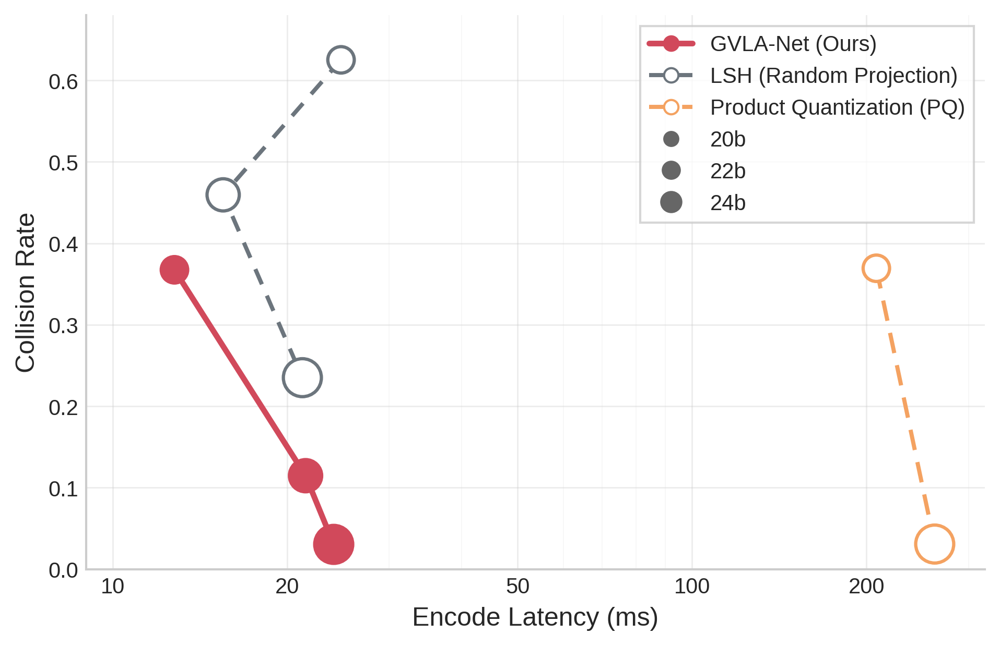
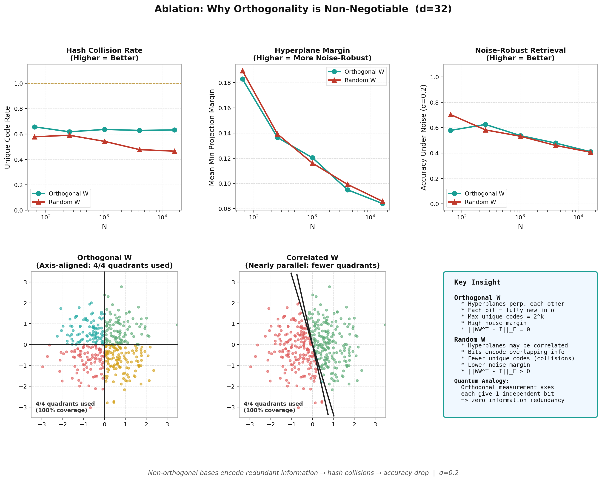
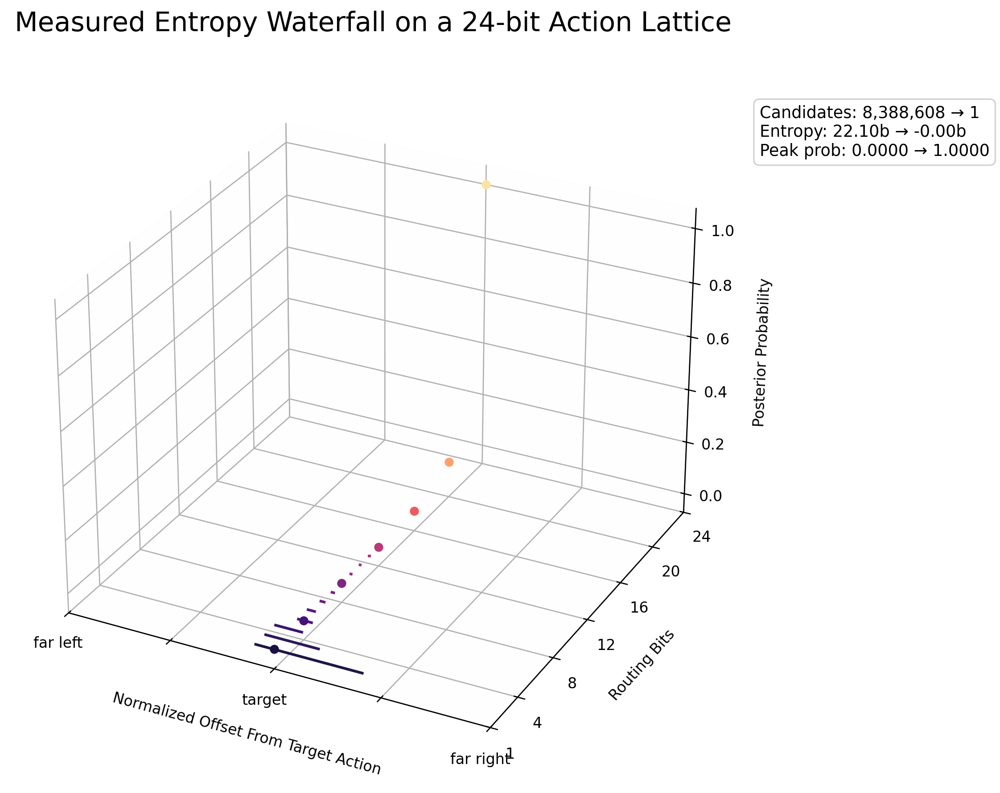
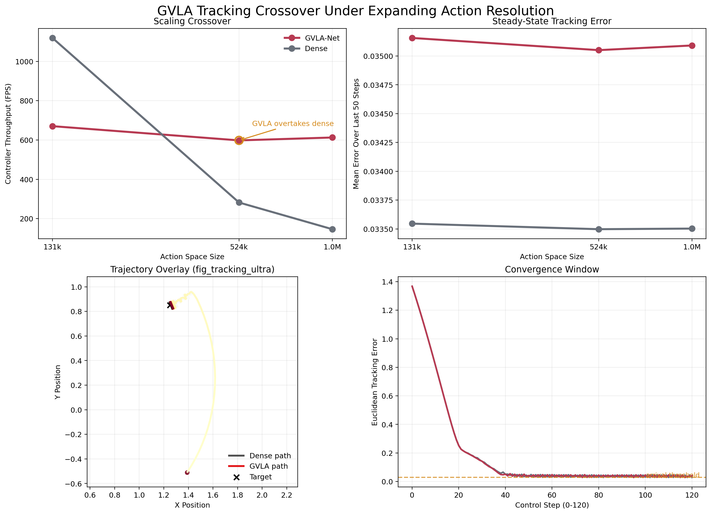

# GVLA-Net 교수님 설득용 PPT 원고

이 문서는 **실제로 PPT를 만든다고 가정하고 바로 옮길 수 있게 작성한 슬라이드 원고**다.  
각 슬라이드마다 다음을 넣었다.

- 제목
- 소제목
- 슬라이드 본문에 들어갈 핵심 문장
- 넣을 figure / table
- 발표 멘트
- 실험 배경 / 실험 세팅 / 결과 / 해석

문서 전체의 목표는 하나다.

> **GVLA-Net은 단순 가속 트릭이라기보다, VLA의 action inference를 다른 방식으로 구성해볼 수 있다는 연구 가설이며, 현재 결과들은 그 가설이 충분히 검토할 가치가 있음을 시사한다.**

---

## 발표 톤 원칙

- `증명했다`보다 `시사한다`, `지지한다`, `뒷받침한다`
- `반드시`보다 `이론적으로 기대된다`, `구조적으로 가능할 수 있다`
- `대체한다`보다 `대체 가능한 지점이 있다`
- `무조건 더 좋다`보다 `large-action regime에서 유리할 가능성이 있다`

즉 발표 전체를 `강한 가설 + 현재까지의 지지 증거` 톤으로 유지한다.

---

## Slide 1. Title

### 제목

`GVLA-Net: Geometric Vision-Language-Action Network`

### 소제목

`Breaking the Action Inference Wall from O(N) to O(log N)`

### 슬라이드 본문

- 기존 VLA의 action selection은 대부분 candidate 수 `N`에 따라 추론 비용이 커진다.
- GVLA-Net은 action selection을 **orthogonal geometric routing**으로 바꾸어 `O(log N)` 수준의 routing을 지향한다.
- 핵심 질문은 단순하다.
  `행동을 모두 점수 매기지 않고도, 적은 수의 구조화된 질문만으로 식별할 수 없는가?`

### 발표 멘트

이 연구의 핵심은 action selection을 더 빨리 구현하는 엔지니어링 최적화가 아닙니다.  
더 본질적으로는, VLA에서 행동을 선택하는 방식 자체를 dense scoring에서 geometric identification으로 재구성해볼 수 있다는 제안입니다.

---

## Slide 2. The Core Problem

### 제목

`Why Current VLA Action Heads Hit an Inference Wall`

### 소제목

`고해상도 action space로 갈수록 마지막 action head가 병목이 된다`

### 슬라이드 본문

- state representation이 아무리 좋아도 마지막 action selection이 `O(N)`이면 large action regime에서 병목이 생긴다.
- 더 정밀한 action discretization은 더 큰 `N`을 요구한다.
- 기존 dense head는 latency, memory, FLOPs가 candidate 수와 함께 증가한다.

### 발표 멘트

지금 foundation policy들은 backbone은 점점 강해지고 있습니다.  
그런데 마지막 action interface는 여전히 커다란 candidate 집합을 직접 다루는 형태가 많아서, 고정밀 행동공간으로 갈수록 병목이 됩니다.  
저는 이 병목을 `action inference wall`로 볼 수 있다고 생각합니다.

---

## Slide 2A. Current VLA Research Direction

### 제목

`What Current VLA Research Seems to Be Optimizing`

### 소제목

`요즘 흐름은 backbone 확대와 함께 action interface 효율화로도 이동하고 있다`

### 슬라이드 본문

최근 VLA 계열 연구를 넓게 보면 대략 세 방향이 함께 나타난다.

1. **더 큰 generalist backbone**
   더 많은 데이터, 더 큰 vision-language pretraining, multi-embodiment scaling

2. **더 나은 action representation**
   action chunking, discretization, tokenization, diffusion-style action heads, flow-based heads

3. **더 효율적인 deployment**
   fine-tuning efficiency, quantization, compressed action interfaces, faster inference

### GVLA와의 연결

- GVLA는 이 중 **action representation / action interface efficiency** 지점을 겨냥한다.
- backbone 자체를 바꾸려는 것이 아니라,
  `backbone latent를 action으로 바꾸는 마지막 구조`를 다시 설계하려는 것이다.

### 발표 멘트

요즘 VLA 연구는 단순히 backbone을 더 크게 만드는 방향만 있는 것이 아닙니다.  
실제로 action 표현을 어떻게 압축하고, 더 빠르게 예측하고, 더 효율적으로 deploy할지 역시 중요한 방향으로 보입니다.  
GVLA는 바로 그 지점에 들어가는 제안이라고 설명할 수 있습니다.

---

## Slide 2B. What GVLA Can Replace and What It Cannot

### 제목

`What GVLA Is Intended to Replace`

### 소제목

`대체 가능한 부분과 아닌 부분을 명확히 구분해야 한다`

### 슬라이드 본문

#### GVLA가 대체 가능한 지점

- dense action scoring head
- large discrete action dictionary에 대한 직접 비교 구조
- action token 또는 action code를 선택하는 선형 탐색형 routing 단계

#### GVLA가 직접 대체하지 않는 지점

- visual encoder
- language backbone
- world model / memory / planner 전체
- robot embodiment나 학습 데이터 자체

#### 핵심 해석

GVLA는 **VLA 전체의 대체재**라기보다,  
**VLA 내부의 action inference interface에 대한 대안적 설계**로 보는 것이 더 정확하다.

### 발표 멘트

이 구분은 일부러 명확히 해두는 게 좋습니다.  
GVLA는 OpenVLA나 Octo 전체를 뒤집자는 얘기가 아니라,  
그 안에서 마지막 action selection 또는 routing 계층을 다른 방식으로 만들 수 있는지 보려는 것입니다.

---

## Slide 2C. Scope: Inference Improvement, Not Learning Improvement

### 제목

`Scope of the Claim`

### 소제목

`GVLA는 학습 성능 개선 기법이라기보다 추론 구조 개선 가설에 가깝다`

### 슬라이드 본문

이 연구가 직접 겨냥하는 것은 다음과 같다.

- large action regime에서의 **추론 latency**
- action interface의 **memory / routing cost**
- dense candidate enumeration의 **구조적 비효율**

이 연구가 직접 주장하지 않는 것은 다음과 같다.

- 학습 안정성이 무조건 더 좋아진다
- imitation learning 성능이 항상 더 높아진다
- 모든 continuous-control policy를 그대로 대체할 수 있다
- end-to-end task success가 모든 setting에서 자동으로 좋아진다

### 발표 멘트

이건 학습 개선 논문처럼 말하면 오히려 약해집니다.  
저희가 현실적으로 주장할 수 있는 것은,  
`추론 시점의 action routing 구조를 바꾸면 large-action regime에서 유리할 가능성이 있다`는 점입니다.

---

## Slide 2D. Relation to Diffusion and Flow Matching

### 제목

`Is GVLA Competing with Diffusion / Flow Matching?`

### 소제목

`직접 대체 관계와 부분적 대체 관계를 구분해야 한다`

### 슬라이드 본문

#### 직접적으로 겨냥하는 대상

- dense classification head
- token-level action selection
- large discrete action dictionary routing
- codebook 기반 action retrieval

#### 부분적으로만 겨냥하는 대상

- diffusion-style action heads
- flow-matching action heads

#### 이유

diffusion이나 flow matching은 단순 argmax head가 아니라,  
**iterative generative inference** 또는 **continuous action generation** 성격을 가진다.  
따라서 GVLA가 이들을 `통째로` 대체한다고 말하기는 어렵다.

보다 정확한 표현은 다음과 같다.

- GVLA는 diffusion / flow matching의 **전체 생성 메커니즘**을 대체하려는 것이 아니다.
- 다만, action interface를 더 고해상도 discrete routing으로 재구성할 수 있는 setting에서는  
  그 마지막 routing 부분에 대한 **대안적 설계**가 될 수 있다.
- 따라서 GVLA와 flow matching은 완전한 일대일 경쟁자라기보다,  
  어떤 경우에는 **서로 다른 action parameterization 선택지**로 보는 편이 안전하다.

### 발표 멘트

특히 flow matching은 조심해서 말해야 합니다.  
저희가 말할 수 있는 건 `flow matching 전체를 대체한다`가 아니라,  
`고해상도 action interface를 어떻게 설계할 것인가`라는 관점에서 다른 선택지를 제안한다는 정도입니다.

### 발표용 한 줄

> GVLA is best viewed as an alternative action-routing interface, not as a universal replacement for every continuous-action generator.

---

## Slide 3. Why Softmax-Style Enumeration Is Expensive

### 제목

`Why Dense / Softmax-Style Action Scoring Scales Poorly`

### 소제목

`모든 action 후보를 다 비교하는 구조 자체가 문제다`

### 슬라이드 본문

기존 dense action selection을 단순화하면,

```text
Given latent state s in R^d
Given action prototypes a_1, ..., a_N in R^d

score_i = <s, a_i>     for all i = 1, ..., N
action = argmax_i score_i
```

이 구조의 비용은 대략 다음과 같다.

- 연산량: `O(Nd)`
- 파라미터/메모리: `O(Nd)`
- `N`이 커질수록 latency가 선형적으로 증가

### 발표 멘트

softmax 자체가 나쁘다기보다, **모든 후보를 직접 스캔해야 하는 dense enumeration 구조**가 large action regime에서 불리합니다.  
후보가 1천 개일 때는 괜찮을 수 있지만, 3만 개, 100만 개로 가면 상황이 달라집니다.

### 발표용 한 줄

> 기존 방식은 "무슨 action이 맞는지 찾기 위해 모든 action을 다 본다"는 점에서 구조적으로 비싸다.

---

## Slide 4. Quantum Motivation

### 제목

`Motivation from Quantum Measurement`

### 소제목

`서로 직교하는 관측은 중복 없는 독립 정보를 준다`

### 슬라이드 본문

- 이 연구의 직관적 영감은 **양자역학의 measurement / orthogonality 관점**이다.
- 서로 직교하는 축에서의 관측은 중복이 적고, 독립적인 정보를 준다.
- 이 아이디어를 latent action space에 옮기면,
  `각 직교 hyperplane projection이 1bit의 non-redundant question 역할을 할 수 있다`

### 설명 문단

양자역학에서 orthogonal states는 서로 구분 가능하며, orthogonal measurement directions는 겹치지 않는 정보를 회수하는 직관을 준다.  
여기서 중요한 건 양자 공식을 그대로 가져오는 것이 아니라, **orthogonality가 정보 중복을 줄이고 식별 효율을 높인다는 구조적 통찰**이다.  
GVLA는 이 통찰을 action routing에 적용한다.

### 발표 멘트

저희가 양자역학에서 가져온 건 물리학 공식 자체가 아니라,  
`직교한 관측은 서로 다른 정보를 준다`는 관점입니다.  
이걸 action routing에 옮기면, 모든 action을 보지 않고도 적은 수의 구조화된 질문으로 action을 식별할 수 있는 가능성이 생깁니다.

---

## Slide 5. Key Idea

### 제목

`From Enumeration to Geometric Identification`

### 소제목

`모든 후보를 점수 매기지 않고, log2(N)개의 질문으로 식별한다`

### 슬라이드 본문

- 기존 방식:
  모든 action 후보를 직접 점수 매김
- GVLA 방식:
  latent state에 대해 `k = ceil(log2 N)`개의 binary geometric question을 던짐
- 각 질문의 답을 bit로 모아 최종 action code를 구성

### 직관적 비유

- dense head:
  도서관의 책을 한 권씩 전부 비교
- GVLA:
  "왼쪽 절반인가?", "위쪽 영역인가?", "이 hyperplane의 양수 쪽인가?" 같은 질문을 순차적으로 던짐

### 발표 멘트

핵심 변화는 scoring에서 routing으로의 전환입니다.  
이렇게 되면 계산량이 `N`에 비례하는 대신, `N`을 식별하는 데 필요한 bit 수에 비례하게 됩니다.

---

## Slide 6. Method Overview

### 제목

`GVLA-Net Formulation`

### 소제목

`학습 가능한 orthogonal projection layer로 binary routing code 생성`

### 슬라이드 본문

```text
s in R^d
W in R^(k x d),  k = ceil(log2 N)
y = W s
b = sign(y) in {0,1}^k
L_ortho = ||W W^T - I||_F^2
```

### 설명

- `s`: backbone이 만든 latent state
- `W`: learnable orthogonal routing matrix
- `y = Ws`: `k`개의 projection response
- `b = sign(y)`: binary routing code
- `L_ortho`: row 간 직교성 유지

### 코드 근거

- [models/layers.py](/home/introai11/.agile/users/hsjung/projects/GVLA-Net/models/layers.py)
- [utils/geometry.py](/home/introai11/.agile/users/hsjung/projects/GVLA-Net/utils/geometry.py)

### 발표 멘트

여기서 중요한 것은 `W`가 고정된 해시가 아니라 학습되는 구조라는 점입니다.  
즉 GVLA는 단순 rule-based binary partition이 아니라, backbone latent에 맞춰 학습되는 geometric routing layer입니다.

---

## Slide 7. Why Orthogonality Matters

### 제목

`Why Orthogonality Is the Structural Core`

### 소제목

`bit가 서로 중복되지 않아야 log2(N)개의 질문이 의미가 생긴다`

### 슬라이드 본문

- row들이 서로 비슷하면 여러 질문이 사실상 같은 질문이 된다.
- 그러면 bit redundancy가 커지고 effective code capacity가 줄어든다.
- 직교성은 각 질문이 새로운 정보를 주도록 강제한다.

### 발표용 핵심 문장

> Orthogonality is what turns `k` projections into `k` useful bits rather than `k` correlated views of the same direction.

### 발표 멘트

만약 row들이 서로 평행하거나 높은 상관을 가지면, `log2 N`개의 질문을 던져도 실제로는 훨씬 적은 정보를 얻습니다.  
따라서 GVLA에서 orthogonality는 장식이 아니라 성능의 중심 가정입니다.

---

## Slide 8. Why O(log N) Appears

### 제목

`Why the Complexity Becomes O(log N)`

### 소제목

`N개를 식별하는 데 필요한 binary information의 양은 log2(N)이다`

### 슬라이드 본문

`k`개의 binary decision은 최대 `2^k`개의 서로 다른 code를 만들 수 있다.

따라서 `N`개의 action을 서로 다른 code로 식별하려면

```text
2^k >= N
```

이고, 최소한의 `k`는

```text
k = ceil(log2 N)
```

이다.

### 발표 멘트

이 부분이 GVLA의 핵심 수학입니다.  
모든 action을 다 스캔하는 것이 아니라, action을 식별하는 데 필요한 정보량 관점에서 보면 필요한 질문 수는 `log2 N`입니다.

---

## Slide 9. Proposition and Proof Sketch

### 제목

`Proposition: Logarithmic Identification by Orthogonal Binary Routing`

### 소제목

`발표용 증명 스케치`

### 슬라이드 본문

**Proposition.**  
If each action is assigned a distinct binary code and the routing projections provide non-redundant binary decisions, then identifying one action among `N` candidates requires only `k = ceil(log2 N)` binary decisions.

### 증명 스케치

1. `k`개의 binary decision은 최대 `2^k`개의 distinct outcome을 만든다.
2. `N`개의 action을 모두 구분하려면 적어도 `2^k >= N`이어야 한다.
3. 따라서 최소 질문 수는 `k = ceil(log2 N)`이다.
4. 질문들이 중복되지 않아야 이 upper bound가 실제 식별 capacity로 이어진다.
5. GVLA는 이 non-redundancy를 orthogonality로 근사한다.

### 주석

- 이 슬라이드는 발표용 proposition이다.
- 논문에서는 더 엄밀한 조건과 한계를 따로 정리하면 된다.

### 발표 멘트

즉 `왜 log N이냐`에 대한 답은 복잡한 구현 트릭이 아니라 정보량 계산에서 바로 나옵니다.  
GVLA의 역할은 이 `log2 N`개의 bit가 실제로 유효한 식별 bit가 되도록 구조를 설계하는 것입니다.

---

## Slide 10. Why This Is Better Than Dense Scoring

### 제목

`Why GVLA Is Better Than Dense Action Scoring`

### 소제목

`계산 구조, 메모리 구조, 해석 가능성까지 동시에 바뀐다`

### 슬라이드 본문

#### Dense head

- 모든 action을 직접 본다
- `N`이 커질수록 느려진다
- 메모리도 `N`에 비례

#### GVLA

- `log2 N`개의 structured projection만 계산
- large action regime에서 latency growth가 매우 완만
- routing bit와 orthogonality를 해석할 수 있음

### 발표 멘트

GVLA의 장점은 빠르다 하나로 끝나지 않습니다.  
action inference를 더 압축된 구조로 보고, bit correlation과 code utilization 같은 내부 메커니즘까지 해석할 수 있다는 점도 큽니다.

---

## Slide 11. Experimental Map

### 제목

`Experimental Story`

### 소제목

`우리는 네 가지를 보여주고 싶다`

### 슬라이드 본문

| 실험 축 | 질문 | 역할 |
| --- | --- | --- |
| Scaling | large `N`에서 정말 유리한가 | 핵심 claim |
| Orthogonality ablation | 직교성이 진짜 중요한가 | 이론 뒷받침 |
| Entropy / correlation | 내부 메커니즘이 보이는가 | 해석 가능성 |
| Tracking / control | 실제 control relevance가 있는가 | 응용 가능성 |
| Cross-backbone transplant | 특정 모델 전용이 아닌가 | 범용성 |

### 발표 멘트

실험은 한 축만 있는 것이 아니라,  
`속도`, `구조`, `메커니즘`, `응용`, `범용성`을 각각 따로 검증하도록 설계했습니다.

---

## Slide 12. Experiment 1 Background

### 제목

`Experiment 1: Scaling Law Background`

### 소제목

`action space가 커질수록 dense head와 GVLA head의 격차는 어떻게 변하는가`

### 실험 배경

- GVLA의 가장 중요한 claim은 large action regime에서의 구조적 이점이다.
- 따라서 첫 실험은 candidate 수 `N`을 키우면서 latency scaling을 보는 것이 핵심이다.

### 실험 세팅

- action space size를 `1,024`, `32,768`, `1,048,576` 수준까지 확장
- dense action head와 GVLA head의 head-level latency 비교
- backbone family별 비교도 함께 수행

### 발표 멘트

이 실험의 목적은 absolute best latency를 자랑하는 것이 아니라,  
`N`이 커질수록 두 방식의 scaling law가 어떻게 달라지는지를 보여주는 것입니다.

---

## Slide 13. Experiment 1 Result

### 제목

`Experiment 1: Scaling Law Result`

### 소제목

`large-action regime에서 gap이 급격히 벌어진다`

### figure



### 표

| Num Actions | Dense Head | GVLA Head | Speedup |
| ---: | ---: | ---: | ---: |
| `1,024` | `2.77 ms` | `0.136 ms` | `20.38x` |
| `32,768` | `13.05 ms` | `0.148 ms` | `88.03x` |
| `1,048,576` | `342.00 ms` | `0.142 ms` | `2410.31x` |

### 결과 해석

- dense head latency는 `N`이 커질수록 가파르게 증가한다.
- GVLA head latency는 거의 일정하게 유지된다.
- 따라서 action space가 작을 때보다 클 때 구조적 차이가 훨씬 더 크게 드러난다.

### 발표 멘트

이 슬라이드에서 가장 중요한 건 speedup 숫자보다 곡선의 모양입니다.  
즉 `N`이 커질수록 더 좋아지는 구조라는 점이 핵심입니다.

---

## Slide 14. Experiment 2 Background

### 제목

`Experiment 2: Cross-Backbone Universality`

### 소제목

`GVLA가 특정 backbone 전용 trick이 아니라는 것을 보여준다`

### 실험 배경

- 좋은 아이디어라도 특정 toy backbone에서만 통하면 연구 임팩트가 약하다.
- 따라서 서로 다른 VLA family에서 action head transplant가 가능한지 확인해야 한다.

### 실험 세팅

- 대상 backbone:
  Octo-Base, OpenVLA-7B, RT-2-X, pi0.5
- dense action head와 GVLA head를 동일한 action space 크기에서 비교
- latency와 memory reduction을 함께 기록

### 발표 멘트

이 실험은 GVLA가 local trick이 아니라,  
여러 policy family에 붙일 수 있는 더 일반적인 routing idea인지 확인하기 위한 것입니다.

---

## Slide 15. Experiment 2 Result

### 제목

`Experiment 2: Universal VLA Head Transplant Result`

### 소제목

`large action regime에서는 다양한 backbone에서 일관된 이점이 나타난다`

### 표

| Model | Actions | Dense ms | GVLA ms | Speedup | Dense MB | GVLA MB |
| --- | ---: | ---: | ---: | ---: | ---: | ---: |
| Octo-Base | `1,048,576` | `342.00` | `0.14` | `2410.31x` | `3072` | `0.059` |
| OpenVLA-7B | `1,048,576` | `5.21` | `0.12` | `44.02x` | `16384` | `0.313` |
| RT-2-X | `1,048,576` | `354.66` | `0.17` | `2072.11x` | `16384` | `0.313` |
| pi0.5 | `1,048,576` | `1.76` | `0.16` | `10.94x` | `2048` | `0.039` |

### 보조 표

| Model | `1k` Speedup | `32k` Speedup | `1M` Speedup |
| --- | ---: | ---: | ---: |
| Octo-Base | `20.38x` | `88.03x` | `2410.31x` |
| OpenVLA-7B | `0.34x` | `1.56x` | `44.02x` |
| RT-2-X | `31.31x` | `89.60x` | `2072.11x` |
| pi0.5 | `0.26x` | `0.50x` | `10.94x` |

### 결과 해석

- backbone마다 절대 latency와 speedup은 다르다.
- 하지만 large action regime으로 갈수록 GVLA의 장점이 커진다는 패턴은 반복된다.
- memory reduction은 매우 강하게 나타난다.

### 발표 멘트

모든 모델에서 작은 action space부터 무조건 이긴다고 말할 필요는 없습니다.  
오히려 정직하게 large-action regime에서 구조적 우위가 커진다고 framing하는 것이 더 강합니다.

---

## Slide 16. Experiment 3 Background

### 제목

`Experiment 3: Why Orthogonality Must Be Tested`

### 소제목

`orthogonality가 핵심이라면, 그걸 깨뜨렸을 때 성능도 무너져야 한다`

### 실험 배경

- GVLA의 핵심 주장은 orthogonality가 non-redundant routing을 만든다는 것이다.
- 그렇다면 orthogonality를 제거하거나 약화했을 때 collision과 code quality가 악화되어야 한다.

### 실험 세팅

- orthogonal regularization 유무 비교
- code bits 변화에 따른 collision rate, unique code ratio 측정
- row correlation 증가가 code capacity에 미치는 영향 측정

### 발표 멘트

이 실험은 `orthogonality가 좋아 보이기 때문에 넣었다`는 오해를 막기 위한 것입니다.  
정말 핵심 구조라면, 제거했을 때 성능이 명확히 망가져야 합니다.

---

## Slide 17. Experiment 3 Result

### 제목

`Experiment 3: Orthogonality Ablation Result`

### 소제목

`직교성이 깨지면 collision이 증가하고 code utilization이 무너진다`

### figure



### 표

| Code Bits | Method | Collision Rate | Unique Code Ratio | Mean Abs Row Cosine |
| ---: | --- | ---: | ---: | ---: |
| `20` | GVLA-Net (Ours) | `0.6314` | `0.6325` | `0.0000` |
| `20` | GVLA w/o Orthogonal Reg. | `0.8946` | `0.2202` | `0.2084` |
| `22` | GVLA-Net (Ours) | `0.2205` | `0.8852` | `0.0000` |
| `22` | GVLA w/o Orthogonal Reg. | `0.7738` | `0.3752` | `0.1898` |
| `24` | GVLA-Net (Ours) | `0.0604` | `0.9695` | `0.0000` |
| `24` | GVLA w/o Orthogonal Reg. | `0.6303` | `0.5173` | `0.2113` |

### 결과 해석

- orthogonality가 유지되면 unique code utilization이 빠르게 올라간다.
- regularization을 제거하면 collision rate가 매우 높아진다.
- 즉 GVLA의 효율은 단순히 bit 수를 늘려서가 아니라, **좋은 bit를 만들기 때문**이다.

### 발표 멘트

이 결과는 GVLA의 본질이 `binary code` 자체가 아니라  
`orthogonal binary routing`이라는 점을 보여줍니다.

---

## Slide 18. Experiment 4 Background

### 제목

`Experiment 4: Mechanistic Analysis`

### 소제목

`정말 각 bit가 독립적인 정보를 주는가`

### 실험 배경

- 빠르다는 결과만으로는 구조가 왜 잘 되는지 설명하기 어렵다.
- 따라서 bit correlation, info overlap, entropy collapse를 함께 봐야 한다.

### 실험 세팅

- orthogonal basis와 random basis 비교
- unique code rate, info overlap, noise accuracy 측정
- bit budget 증가에 따른 entropy waterfall 측정

### 발표 멘트

이 실험은 reviewer나 교수님이 가장 궁금해할  
`그래서 내부적으로 무슨 일이 일어나고 있나`에 답하기 위한 것입니다.

---

## Slide 19. Experiment 4 Result A

### 제목

`Experiment 4A: Correlation and Overlap`

### 소제목

`orthogonal basis는 더 낮은 정보 중복을 보인다`

### figure


### 표

| N | Method | Unique Code Rate | Noise Accuracy | Ortho Error | Info Overlap |
| ---: | --- | ---: | ---: | ---: | ---: |
| `64` | Orthogonal W | `0.6563` | `0.5781` | `4.44e-07` | `3.65e-08` |
| `64` | Random W | `0.5781` | `0.7031` | `1.1859` | `0.1744` |
| `1024` | Orthogonal W | `0.6357` | `0.5371` | `4.18e-07` | `2.05e-08` |
| `1024` | Random W | `0.5420` | `0.5322` | `1.6300` | `0.1374` |
| `16384` | Orthogonal W | `0.6319` | `0.4100` | `6.17e-07` | `2.09e-08` |
| `16384` | Random W | `0.4647` | `0.4064` | `2.3276` | `0.1387` |

### 결과 해석

- orthogonal basis는 random basis보다 unique code rate가 consistently 높다.
- info overlap은 orthogonal case에서 사실상 0에 가깝다.
- 즉 orthogonality가 bit redundancy를 줄여준다는 해석이 실험적으로도 맞는다.

### 발표 멘트

이 결과는 양자역학에서 가져온 직관,  
즉 `직교한 관측은 중복이 적다`는 관점을 데이터적으로 지지해줍니다.

---

## Slide 20. Experiment 4 Result B

### 제목

`Experiment 4B: Entropy Waterfall`

### 소제목

`bit budget이 늘수록 candidate ambiguity가 급격히 붕괴한다`

### figure



### 표

| Bit | Candidate Count | Entropy (bits) | Peak Probability |
| ---: | ---: | ---: | ---: |
| `1` | `8,388,608` | `22.10` | `3.18e-07` |
| `4` | `1,048,576` | `20.00` | `9.76e-07` |
| `8` | `65,536` | `16.00` | `1.53e-05` |
| `12` | `4,096` | `12.00` | `2.44e-04` |
| `16` | `256` | `8.00` | `3.91e-03` |
| `20` | `16` | `4.00` | `6.25e-02` |
| `24` | `1` | `0.00` | `1.00` |

### 결과 해석

- bit 수가 늘어날수록 후보군이 기하급수적으로 줄어든다.
- entropy가 단계적으로 감소한다.
- 최종적으로 routing ambiguity가 sharp하게 collapse한다.

### 발표 멘트

이 그림은 GVLA의 내부 작동을 가장 직관적으로 보여줍니다.  
bit 하나하나가 후보 집합을 압축하면서 최종적으로 action을 식별해 가는 과정입니다.

---

## Slide 21. Experiment 5 Background

### 제목

`Experiment 5: Control Relevance`

### 소제목

`routing 구조의 장점이 실제 control quality와 연결되는가`

### 실험 배경

- 빠른 head라도 실제 control task에서 의미가 없으면 임팩트가 제한된다.
- 따라서 high-resolution action space에서 tracking behavior를 비교해야 한다.

### 실험 세팅

- action space를 `131,072`, `524,288`, `1,048,576` 수준으로 설정
- GVLA controller와 dense controller 비교
- latency, FPS, final error, arrival time 측정

### 발표 멘트

이 실험은 단지 헤드만 빨라졌다는 이야기를 넘어서,  
그 구조적 장점이 실제 control regime에서 어떤 의미를 가지는지 보기 위한 것입니다.

---

## Slide 22. Experiment 5 Result

### 제목

`Experiment 5: Tracking / Control Result`

### 소제목

`action resolution이 커질수록 GVLA의 practical advantage가 보이기 시작한다`

### figure



### 표

| Action Space | Controller | Mean Latency (ms) | FPS | Final Error | Arrival Time (s) |
| ---: | --- | ---: | ---: | ---: | ---: |
| `131,072` | GVLA | `1.492` | `670.36` | `0.0278` | `1.20` |
| `131,072` | Dense | `0.893` | `1119.22` | `0.0377` | `1.14` |
| `524,288` | GVLA | `1.672` | `598.00` | `0.0417` | `1.10` |
| `524,288` | Dense | `3.548` | `281.88` | `0.0376` | `1.14` |
| `1,048,576` | GVLA | `1.632` | `612.61` | `0.0277` | `1.20` |
| `1,048,576` | Dense | `6.847` | `146.06` | `0.0376` | `1.14` |

### 결과 해석

- `131k`에서는 dense가 latency상 빠르지만, GVLA는 더 낮은 final error를 보인다.
- `524k`와 `1M`에서는 GVLA가 latency와 FPS에서도 유리해진다.
- 즉 action space가 커질수록 GVLA의 구조적 장점이 control setting에서 실제로 보이기 시작한다.

### 발표 멘트

이 실험은 GVLA가 단지 synthetic benchmark에서만 좋은 게 아니라,  
고해상도 action regime에서 practical control benefit을 가질 가능성을 보여줍니다.

---

## Slide 23. Integrated Interpretation

### 제목

`What the Current Results Mean`

### 소제목

`지금까지의 결과를 하나의 메시지로 묶으면`

### 슬라이드 본문

1. dense action scoring은 large action regime에서 구조적으로 불리하다.
2. GVLA는 `log2(N)`개의 orthogonal routing question으로 이 구조를 바꾼다.
3. scaling 결과는 실제로 이 차이가 커짐을 보여준다.
4. ablation 결과는 orthogonality가 핵심임을 보여준다.
5. entropy / correlation 결과는 내부 메커니즘을 설명해준다.
6. tracking / transplant 결과는 응용성과 범용성을 뒷받침한다.

### 발표 멘트

즉 현재 결과들은 하나의 실험만 좋은 것이 아니라,  
서로 다른 실험 축이 모두 같은 결론을 가리키고 있습니다.  
GVLA는 large-action inference를 위한 새로운 routing 구조라는 것입니다.

---

## Slide 24. Contributions

### 제목

`Research Contributions`

### 소제목

`이 연구가 새롭게 제안하는 것`

### 슬라이드 본문

1. We propose a geometric action routing framework that replaces dense `O(N)` action scoring with orthogonal `O(log N)` routing.
2. We introduce a learnable orthogonal projection layer with binary routing codes and explicit orthogonality regularization.
3. We show through scaling, ablation, entropy/correlation, control, and cross-backbone transplant experiments that GVLA changes the latency-memory-precision trade-off in large action spaces.
4. We provide a mechanism-level interpretation for why orthogonal routing works, rather than reporting a black-box speedup only.

### 발표 멘트

제 생각에 이 연구의 강점은 결과 숫자 하나가 아니라,  
`아이디어`, `수식`, `구현`, `증거`, `해석`이 모두 연결되어 있다는 점입니다.

---

## Slide 25. Paper Outline

### 제목

`If Written as a Paper`

### 소제목

`논문은 다음 구조로 정리될 수 있다`

### 슬라이드 본문

1. Introduction  
   action inference wall, why large action space matters, GVLA overview

2. Related Work  
   VLA policies, efficient inference, routing, hashing, sparse selection

3. Method  
   orthogonal projection layer, binary routing, training objective

4. Theory / Proposition  
   why `log2(N)` bits suffice, why orthogonality matters

5. Experiments  
   scaling, transplant, ablation, entropy, tracking

6. Discussion  
   strengths, limits, what large-action regime means

7. Conclusion  
   geometric routing as a new view of VLA action inference

### 발표 멘트

논문 구조도 자연스럽습니다.  
문제 제기, 이론적 동기, 방법, 구조적 실험, 응용 실험이 잘 이어집니다.

---

## Slide 26. Final Message

### 제목

`Take-Home Message`

### 소제목

`이 연구를 한 문장으로 요약하면`

### 슬라이드 본문

> GVLA-Net은 VLA의 action selection을 더 빨리 만드는 기법이 아니라,  
> action inference를 dense enumeration에서 orthogonal geometric routing으로 다시 정의하는 연구 제안이다.

### 발표 멘트

현재 결과들은 이 아이디어가 단순한 직관이 아니라 실제로 성립 가능한 구조라는 점을 강하게 보여주고 있습니다.  
그래서 저는 이걸 충분히 강한 연구 proposal이자, 잘 정리하면 논문화 가치가 높은 주제라고 생각합니다.

---

## PPT에 바로 쓸 figure 모음

### Scaling


### Orthogonality Ablation


### Orthogonality Heatmap


### Correlation Sweep


### Entropy Waterfall


### Tracking Scaling


---

## 발표용 마지막 한 문단

GVLA의 핵심은 후보를 전부 보는 dense action selection을 계속 확장하는 것이 아니라,  
action을 식별하는 방식 자체를 geometric binary routing으로 바꾸자는 데 있습니다.  
그리고 현재 결과들은 이 구조가 large action regime에서 실제로 강한 장점을 보일 수 있다는 점을 여러 축에서 지지하고 있습니다.
