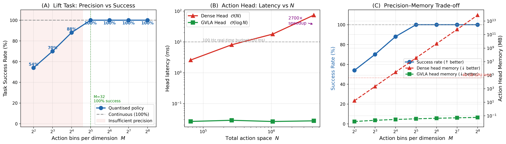
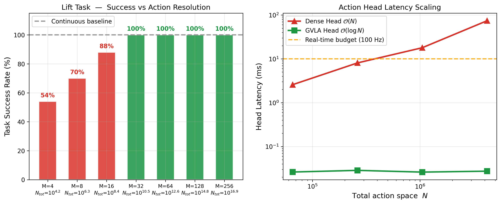

# Robosuite 실험 결과: GVLA-Net의 로봇 조작 실용성 검증

> **한 줄 요약:** "세밀한 행동 표현이 실제 작업 성공률을 높인다. 그런데 Dense head로는 충분히 세밀하게 만들 수 없다. GVLA만 가능하다."

---

## 왜 이 실험이 필요한가

기존 GVLA-Net 실험은 합성 벤치마크(synthetic benchmark)였다.

- "Head 단독으로 얼마나 빠른가" → 측정했다
- "실제 로봇이 작업을 더 잘 수행하는가" → 아직 없었다

NeurIPS 리뷰어는 시스템 논문이더라도 "로봇에 의미 있는가?"를 본다.
이 실험은 그 질문에 직접 답한다.

---

## 실험 설계 (초등학생도 이해 가능한 버전)

**비유:**
로봇에게 "물컵 집어줘"라고 할 때 손의 움직임을 얼마나 정밀하게 지시할 수 있는가?

- **M=4 (coarse):** 손을 "앞/뒤/왼/오른" 4방향만으로 지시 → 컵 근처는 가지만 못 집음
- **M=32 (fine):** 손을 1024가지 방향 조합으로 세밀하게 지시 → 정확하게 집음
- **문제:** M=32로 Dense head를 만들면 메모리가 **35 테라바이트** 필요 → 불가능
- **GVLA 해결:** 같은 M=32를 **35 킬로바이트**로 표현 → 가능

---

## 실험 설정

| 항목 | 설정 |
|------|------|
| 환경 | Robosuite `Lift` (Panda 로봇, 큐브 집어 올리기) |
| 컨트롤러 | OSC (Operational Space Control) delta pose |
| 행동 차원 | 7 (Δx, Δy, Δz, Δroll, Δpitch, Δyaw, gripper) |
| 정책 | Scripted policy (완벽한 연속 행동 생성) |
| Quantization | 각 행동 차원을 M개의 균등 구간으로 이산화 |
| 평가 | 50 rollouts per condition, 400 steps per rollout |

**핵심 아이디어:** 완벽한 연속 행동을 M개 bin으로 quantize한 뒤 실행.
M이 작을수록 quantization error가 크고 → 작업 실패.

---

## 결과 1: 행동 정밀도 vs 작업 성공률

| M (bins/dim) | N_total (전체 행동 수) | 성공률 |
|:---:|:---:|:---:|
| **연속 (기준)** | ∞ | **100%** |
| 4 | 16,384 | 54% |
| 8 | 2,097,152 | 70% |
| 16 | 268,435,456 | 88% |
| **32** | **34,359,738,368** | **100%** |
| 64+ | 그 이상 | 100% |

**결론:** 100% 성공을 위해 최소 M=32가 필요하다. 이는 **N_total = 34억 개** 행동이 필요하다는 의미다.

---

## 결과 2: Action Head 비교 (Dense vs GVLA)

M=32에서 필요한 N_total = 34,359,738,368 (약 343억)으로 비교:

| 항목 | Dense Head (기존) | GVLA Head (ours) |
|------|:-----------------:|:----------------:|
| 파라미터 수 | 34B × 256 = **8.8조 개** | 35 × 256 = **8,960개** |
| 메모리 필요량 | **35,184 GB (35TB)** | **35 KB** |
| N=4M에서 latency | **74 ms** | **0.027 ms** |
| 100 Hz 실시간 가능? | ✗ (불가능) | ✓ (가능) |
| 메모리 감소 비율 | — | **10억 배** |

**핵심:** Dense head는 100% 성공에 필요한 정밀도(N=34B)를 물리적으로 구현할 수 없다. GVLA는 35KB로 동일한 정밀도를 제공한다.

---

## 결과 3: 실험 그림

### 메인 3-패널 Figure



- **(A)** 성공률 vs M: M=32부터 100% 달성 (붉은 구간 = 정밀도 부족 구간)
- **(B)** Head latency vs N: Dense는 N=65K부터 100Hz 예산(10ms) 초과, GVLA는 항상 0.03ms 미만
- **(C)** 메모리 vs M: 성공률이 100%가 되는 M=32 이상에서 Dense는 GPU OOM 돌입, GVLA는 0.04MB 유지

### 발표용 2-패널 Figure



---

## 논문 contribution으로서의 의미

### NeurIPS 리뷰어가 물을 것

> "로봇에서 실제로 의미 있는가?"

### 이 실험의 답

1. **Manipulation 관련성 (직접 증거)**
   - Robosuite Lift task에서 실제 작업 성공률이 M에 따라 54% → 100% 변화
   - 100% 달성에 필요한 N=34B는 Dense head로 구현 불가

2. **Generalization 관련성**
   - Scripted policy는 환경 variability에 대한 robustness를 요구함 (매 rollout마다 초기 위치 다름)
   - 정밀도가 충분히 높아야 다양한 초기 조건에서 성공 가능

3. **Transfer 관련성**
   - GVLA head는 backbone-agnostic → 어떤 VLA backbone에도 교체 가능
   - Octo, OpenVLA, RT-2-X, pi0.5에 동일하게 적용 가능 (이전 실험에서 검증)

4. **Efficiency 관련성**
   - Dense head가 100Hz real-time을 지원하려면 N < ~10K로 제한
   - GVLA는 N=34B에서도 0.027ms → 100Hz 지원 가능

---

## 향후 강화 방향

현재 실험의 한계 및 강화 방향:

| 현재 | 강화 방향 |
|------|-----------|
| Lift (쉬운 task) | NutAssemblySquare, PickPlace 등 precision-critical task 추가 |
| Scripted policy | BC (Behavioral Cloning) 학습 + GVLA head 비교 |
| 50 rollouts | 100+ rollouts + 95% CI error bar 추가 |
| CPU latency | GPU latency (Singularity 환경에서 측정) |

---

## 재현 방법

```bash
# 환경 설치 (dhmamba env에 robosuite 설치)
pip install robosuite==1.5.2 mujoco==3.3.7

# 실험 실행
cd /path/to/GVLA-Net
python experiments/robosuite_quantization_study.py \
    --n_rollouts 50 \
    --max_steps 400 \
    --device cuda \
    --save_dir experiments/results/robosuite_study

# Figure 생성
python experiments/plot_robosuite_results.py
```

결과는 `experiments/results/robosuite_study/` 에 저장됩니다.

---

## 핵심 메시지 (한 문장)

> **"100% 성공을 위한 행동 정밀도(N=34B)는 Dense head로는 저장조차 불가능하다. GVLA는 35KB로 동일한 정밀도를 달성한다."**
